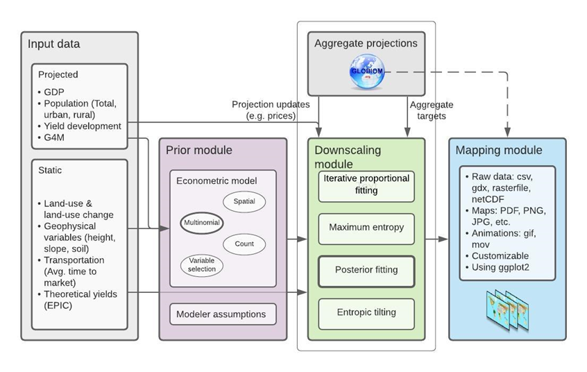

```{r, echo=FALSE}
knitr::opts_chunk$set(
  collapse = TRUE,
  comment = "#>",
  fig.width=8, 
  fig.height=6
)
```

Before we start with anything, we need to make sure we have some crucial R-packages installed & loaded:

```{r, echo=TRUE, message=FALSE}
require(dplyr)
require(tidyr)
```

Now we good to go:

## Introduction

This tutorial will show you how to downscale land-use (LU) and/or land-use change (LUC) as output from GLOBIOM (or similar IAMs). We will walk through the main ingredients, concepts & tools required as well as different *downscale*-techniques – from the most naïve approach to eventually using the full routine as provided by the `downscalr`-package.

Before we begin the downscaling process, it's important to introduce some key concepts—as well as a few helpful auxiliary tools along the way:

1.  **LUC Targets**: These are land use change (LUC) quantities or goals that we aim to disaggregate to a finer spatial resolution.

2.  **Start Map**: We have a high-resolution grid of LU that serves as the spatial template for where the targets will be allocated. This is often referred to as an *initial condition*.

3.  **Allocation Method**: We apply a specific allocation method to determine how the LUC targets are distributed across the high-resolution grid.

## 1. LUC **targets**

In the context of LUC the large partial equilibrium model *GLOBIOM* tells us something like: between **2030 & 2040** an area of **133 km²** of **Other Natural Land** is converted to **Cropland** in **Austria** or in during the decade before **2050** inside **France** **646km²** of **Pasture** areas are transitioning to **Cropland**.

So let's read in some example LUC targets from GLOBIOM run and get familiar how that might look like:

```{r echo=TRUE}
## reading in the LUC target file 
LUC_targets <- readRDS("input/LAMASUSSS_GLOBIOM_LUC_targets.rds")
head(LUC_targets)
```
The first column **Ns** contains countries (our coarse resolution we want to refine), the timesteps are stored in **times** (encoded such that, for instance *2010*, refers to the endpoint of the decade *2000–2010*). And the next three columns indicate the direction & magnitude of the LUC transition (corresponding to the country and timestep in the same row) we observe. Specifically, **lu.from** indicates the LU at the start, **lu.to** the one at the end of the decade and **value** the amount (here in *km²*) changing from *lu.from → lu.to*. Consequently, each row identifies one unique LUC transition.
In summary, now we know already how much (**value**) of what (*lu.from → lu.to*) we need to allocate when (**times**) inside which country (**Ns**). Next, we create our *start map* in order to distribute our targets onto a finer resolution.

## 2. **Start Map**

To effectively downscale our targets, we need a high-resolution representation of land use around the year 2000. In this tutorial, we use a *CLC* land cover dataset for the year 2000 that has already been aggregated to a 1×1 km resolution and covers EU member states, EEA members and other cooperating countries (e.g. Turkey, Serbia, North Macedonia etc.).
Again, first we take a look at the raw data:

```{r echo=TRUE}
## reading in the CLC year 2000 landcover data at 1x1km resolution
start_map_raw <- readRDS("input/raw_start_map_1km.rds")
head(start_map_raw)
```

Here, **EEA_1kmID** contains unique identifiers to pixels on our 1x1km grid. But this dataset contains a lot of data points (~44 million). Actually, lets decrease the resolution a bit and maybe subset to a specific country case - easier to handle ! 
In this way we can also introduce an important *auxiliary tool* of *mapping between resolutions*:

```{r echo=TRUE}
## reading in resolution mapping file
resolution_mapping <- readRDS("../LAMASUSSS/input/resolution_mapping_LAMASUS.rds")
head(resolution_mapping)

```

Now, we are able to assign our **EEA_1kmID** to the lower pixel resolution of 10x10km identified by **EEA_10kmID**, or straight up to the country level with **Ns**. So let's aggregate our start map from the 1x1km resolution to the 10x10km resolution and subset to a country of our choice.

```{r echo=TRUE}
## join resolution mapping to start map and aggregate by group
start_map <- left_join(resolution_mapping,
                          start_map_raw, 
                          by="EEA_1kmID") %>%
  group_by(Ns,EEA_10kmID,x_10km,y_10km,Code1) %>% 
    reframe(area_km2=sum(area_km2)) %>%
      filter(Ns=="Austria")
head(start_map)

```

Ok, now we aggregated our landcover data to the 10km² grid and subseted our data to *Austria*. Now is a good time to visualize whether where we are is where we want to be and our data wrangling survives the eye test.
Note, that we have also  **x** & **y** (longitude & latitude of our **EEA_1kmID** pixels) and their corresponding **EEA_10kmID** counterparts (**x_10km** & **y_10km**) . Those will help our plotting device (`ggplot2`) to locate each data point in space. So let's do that (and what does Code1 contain anyways?):

```{r echo=TRUE}
require(ggplot2)
#set extent to zoom in on Austria and adjust for 10km resolution.
extent <- c(xmin = 4300000,ymin = 2600000, xmax = 4900000, ymax =2900000)
## Europe extent 
#extent <- c(xmin = 2611000,ymin = 1361000,xmax = 6552000, ymax =5440000)

#load in country borders file
Ns_shp <- readRDS("input/nuts0_shp.rds")
plot <- ggplot() +
  geom_tile(data =  start_map %>% filter(Code1==111), 
            aes(x = x_10km, y = y_10km, fill = area_km2)) +
  scale_fill_gradient(
    low = "lightyellow", high = "saddlebrown", na.value = "grey"
  ) +
  geom_sf(data = Ns_shp, fill = NA, colour = "black", size = 50, lwd = .5) +
  coord_sf(xlim = c(extent["xmin"], extent["xmax"]), 
           ylim = c(extent["ymin"], extent["ymax"])) +
  theme_bw(base_size = 18)
plot

```

We plotted successfully something inside Austria. However, what could that represent or rather what is encoded under ***Code1==111***? 
Well, this brings us straight to our next *auxiliary tool*: a *thematic mapping*, which bridges between different landcover/landuse classifications.
Without further ado, let's take a look what that looks like:
```{r echo=TRUE}
thematic_mapping <- read.csv("input/LAMASUSSS_thematic_mapping.csv")
head(thematic_mapping, nrow(thematic_mapping))
```
Then we use it straight to aggregate the *CLC thematic resolution Code1* down to the *augmented UNFCC classification* that is compatible with GLOBIOM and what we saw already in the targets. 

```{r echo=TRUE}
require(ggplot2)
#Let's map to our GLOBIOM_UNFCC classification
start_map <- left_join(start_map,thematic_mapping, by="Code1") %>%
              group_by(Ns,EEA_10kmID,x_10km,y_10km,GLOBIOM_UNFCC) %>% 
                reframe(area_km2=sum(area_km2))
## Let's plot UNFCCC Urban
plot <- ggplot() +
  geom_tile(data =  start_map %>% filter(GLOBIOM_UNFCC=="Urban"), 
            aes(x = x_10km, y = y_10km, fill = area_km2)) +
  scale_fill_gradient(
    low = "lightyellow", high = "saddlebrown", na.value = "grey"
  ) +
  geom_sf(data = Ns_shp, fill = NA, colour = "black", size = 50, lwd = .5) +
  coord_sf(xlim = c(extent["xmin"], extent["xmax"]), 
           ylim = c(extent["ymin"], extent["ymax"])) +
  theme_bw(base_size = 18)
plot

```

That's it, we succesfully created our **start map**! We not only aggregated our raw CLC data to the 10x10km resolution, but also thematically to match GLOBIOM's classification. Now, we are set to downscale. But how are we going to do that?

## 3.  **Allocation Method**

We have our targets (1.), we have our start map (2.), now we need to distribute the former onto the later. Next, we are going to introduce (very) basic downscaling approaches, which require little effort, to finally running the full routine behind the `downscalr`-package.

First, we select one transition to showcase the applied principles.
Here, we already subset Austria, we have a start map representing the year 2000. That's already helpful in our selection:

```{r echo=TRUE}
LUC_targets_example <- LUC_targets %>%
                        filter(Ns=="Austria",
                               times==2010,
                               lu.from=="OtherNaturalLand",
                               lu.to=="Pasture")

LUC_targets_example
```

So we are first trying to downscale inside **Austria** by **2010** the single transition from **OtherNaturalLand** to **Pasture**.

## Most naïve (everywhere is something)
For the sake of example, we pretend our start map contains no information of the LUs each pixel contains. 
```{r echo=TRUE}
# Let's drop all LU information and aggregate
naive_start_map <- start_map %>% group_by(Ns,EEA_10kmID,x_10km,y_10km) %>% 
                      reframe(area_km2=sum(area_km2)) # lu.from we treat as NA

naive_downscale_res <- left_join(naive_start_map,LUC_targets_example, by="Ns") %>%
                         mutate(value_downscaled=value*(area_km2/sum(area_km2)))

                      
```

So we simply added knowledge on the pixel size and assumed the transition of **186km2** from **OtherNaturalLand** to **Pasture** is distributed equally (almost, the size of all pixels is not uniform) across Austria. Let's plot that.

```{r echo=TRUE}
#Let's map to our GLOBIOM_UNFCC classification
plot <- ggplot() +
  geom_tile(data =  naive_downscale_res, 
            aes(x = x_10km, y = y_10km, fill = value_downscaled)) +
  scale_fill_gradient(
    low = "lightyellow", high = "saddlebrown", na.value = "grey"
  ) +
   labs(
    fill = "area_km2"
  ) +
  geom_sf(data = Ns_shp, fill = NA, colour = "black", size = 50, lwd = .5) +
  coord_sf(xlim = c(extent["xmin"], extent["xmax"]), ylim = c(extent["ymin"], extent["ymax"])) +
  theme_bw(base_size = 18)
plot

```

Of course, this oversimplified example is hardly satisfactory, however, technically speaking (with some stretch of the definition) this can already be considered downscaling LUC. Let's add some information back. We actually know in which pixels **OtherNaturalLand** is present and, subsequently, where the transition could take place to begin with. This looks like as follows:

## Less naïve (somewhere is **OtherNaturalLand**)

```{r echo=TRUE}
# Let's keep the LU information, but ignore its area information
naive_start_map <- start_map %>% group_by(Ns,EEA_10kmID,x_10km,y_10km) %>%
                    reframe(area_km2=sum(area_km2),
                            lu.from=GLOBIOM_UNFCC) # lu.from we treat as NA

naive_downscale_res <- left_join(naive_start_map,LUC_targets_example, 
                                 by=c("Ns","lu.from")) %>%
                        group_by(lu.from) %>%
                         mutate(value_downscaled=value*(area_km2/sum(area_km2))) %>% 
                          drop_na()

                      
```


Let's see how that looks like.
```{r echo=TRUE}
#Let's map to our GLOBIOM_UNFCC classification
plot <- ggplot() +
  geom_tile(data =  naive_downscale_res, 
            aes(x = x_10km, y = y_10km, fill = value_downscaled)) +
  scale_fill_gradient(
    low = "lightyellow", high = "saddlebrown", na.value = "grey"
  ) +
   labs(
    fill = "area_km2"
  ) +
  geom_sf(data = Ns_shp, fill = NA, colour = "black", size = 50, lwd = .5) +
  coord_sf(xlim = c(extent["xmin"], extent["xmax"]),
           ylim = c(extent["ymin"], extent["ymax"])) +
  theme_bw(base_size = 18)
plot

```

## Pixel share downscaling (somewhere is **OtherNaturalLand** and we know how much)

Since we know the land use (LU) area each pixel contains from our start map, we build a simple downscaling rule around it. We assume that the amount of land converted to **Pasture** depends on the initial endowment of **OtherNaturalLand** in each pixel. In other words, the transition to **Pasture** is distributed only across pixels that contain **OtherNaturalLand**, and the amount assigned to each pixel is proportional to that pixel’s share of the total **OtherNaturalLand** area in Austria.
In our simple example, this is translates as follows to code:

```{r echo=TRUE}
# Let's keep the LU information, but ignore its area information
naive_start_map <- start_map %>% rename(lu.from=GLOBIOM_UNFCC) %>% 
                    group_by(Ns,EEA_10kmID,x_10km,y_10km,lu.from) %>% 
                      reframe(area_km2=sum(area_km2)) # lu.from we treat as NA

naive_downscale_res <- left_join(naive_start_map,LUC_targets_example, 
                                 by=c("Ns","lu.from")) %>%
                        group_by(lu.from) %>%
                         mutate(value_downscaled=value*(area_km2/sum(area_km2))) %>% 
                          drop_na()

                      
```

And now we plot it again.

```{r echo=TRUE}
#Let's map to our GLOBIOM_UNFCC classification
plot <- ggplot() +
  geom_tile(data =  naive_downscale_res, 
            aes(x = x_10km, y = y_10km, fill = value_downscaled)) +
  scale_fill_gradient(
    low = "lightyellow", high = "saddlebrown", na.value = "grey"
  ) +
   labs(
    fill = "area_km2"
  ) +
  geom_sf(data = Ns_shp, fill = NA, colour = "black", size = 50, lwd = .5) +
  coord_sf(xlim = c(extent["xmin"], extent["xmax"]), 
           ylim = c(extent["ymin"], extent["ymax"])) +
  theme_bw(base_size = 18)
plot

```

With this simple rule we can already create some spatial variation across pixels containing our **lu.from** class. But for the sake of illustration some further important concepts of downscaling have been neglected. We turn to them now by introducing downscaling with the `downscalr`-package. 


## Minor detour: Introducing the [`downscalr` package](https://github.com/tkrisztin/downscalr)

The [`downscalr` package](https://github.com/tkrisztin/downscalr) provides an accessible and user-friendly way to apply the **downscalr** framework for land-use downscaling tasks. The **downscalr** framework bridges the gap between observed **land-use change** (LUC), drivers of LUC, and aggregate LUC targets. One key advantage is its ability to estimate **priors** using an empirical econometric model—if observational data is available. This model links a set of exogenous variables and dynamically updated endogenous variables to observed LUC patterns. In this context, **priors** simply refer to LUC predictions derived from the econometric model based on static and/or dynamic input data.

The **downscalr** model is fully compatible with the **GLOBIOM** integrated assessment model, which can generate high-resolution land-use change projections at up to 5 arcminute resolution. *Figure 1* below illustrates the components involved and the overall structure of the downscaling process. It is important to note, however, that aggregate LUC targets to be downscaled do not have to originate from **GLOBIOM**. For example, in the vignette of the [`downscalr` package](https://github.com/tkrisztin/downscalr), we demonstrate the downscalr routine using LUC targets for Argentina obtained from the **FABLE** calculator.
```{r echo=FALSE, fig.align = 'center', out.width = "90%",  fig.cap = "Fig. 1 - Overview of the GLOBIOM downscalr framework"}

```


In the sections that follow, we walk through each step of Figure 1—from left to right—and demonstrate how the process is implemented in R. We begin by introducing the downscaling workflow in detail, focusing on transitions from a single LU class and projections for one future time step. Once the core functionality of the downscalr package is clear, we provide examples of a complete downscaling workflow along with additional routines that may be useful for broader applications.

```{r message=FALSE, warning=FALSE}
#install.packages("tidyr","tibble","dplyr")
library(tibble)
library(reshape2)

#devtools::install_github("tkrisztin/downscalr",ref="HEAD")
library(downscalr)
```

### Input data & Prior module

The input data mostly enters the downscaling procedure via the **prior module** as its the informational basis for the empirical prediction of the priors to the downscaling module. The econometric framework employed here is a **Bayesian Multinomial logistic** (MNL) model, which perceives categorical LUC observations, i.e. Y, as a response of some explanatory data set, i.e. X.

Moreover, LUC is basically the result of some mapping from each LU class to all LU classes. In practice that implies the MNL model is estimated for all LUC origin classes separately, however, for the sake of this tutorial we first limit the scope to one example and only consider LUC stemming from LU class *Cropland*.

#### Prior module: preliminaries

First, load the examplary data within `downscalr` package and transform it into the necessary format for the MNL model.

```{r message=FALSE}
# Set example land use change origin to Cropland and all destinations
example_lu.from <- "OtherNaturalLand"
example_lu.to <- c("Pasture","Cropland","OtherNaturalLand","Forest")

# load transition data, raw data are CLC changes (and non-changes) between the years 2000 & 2018
transition_data <- readRDS("input/transition_data.rds")
# we rename our 10km identifier to "ns" as required by the downscalr::downscale()
transition_data <- transition_data %>% rename(ns=EEA_10kmID)
transition_matrix <- transition_data %>% filter(lu.from %in% c(example_lu.from),
                                                lu.to %in% c(example_lu.to)) %>%
                        group_by(ns,lu.from) %>%
                         mutate(LUC_share=area_km2/sum(area_km2),
                                LUC_share=ifelse(!is.finite(LUC_share),0,LUC_share)) %>%
                            select(!area_km2) %>%
                              pivot_wider(names_from=lu.to,values_from=LUC_share) %>%
                                mutate(no_choice=1-rowSums(across(example_lu.to))) %>%
                                  ungroup()
##readRDS("input/transition_matrix_simple.rds")
# Prepare data for econometric Multinomial logistic (MNL) regression
X_input <- readRDS("input/X_input_n2k.rds")


Y <- transition_matrix %>%
            dplyr::select(-c(times))

X <- X_input %>%
          dplyr::select(-times) %>% mutate(Intercept=1)
```


#### Prior module: estimate MNL model

The MNL function requires the data input to be in matrix format. Further note, the baseline category is always set to the LUC origin class, i.e. currently set to Cropland. The other inputs control the amount of after burn-in draws, i.e. $niter-nburn$, from the *Gibbs Sampler* and the prior variance of the model coefficients $A0$. For now they can be kept to their default values.

```{r results = "hide", message=FALSE}
#Compute MNL model with standard settings
Y.temp <- Y %>% filter(lu.from %in% example_lu.from) %>% select(-c(lu.from))
Y.temp <- Y.temp[match(X$ns,Y.temp$ns),] %>% select(-ns) %>% as.matrix()
# here we ensure the response IDs match predictor row IDs
X.temp <- X %>% select(-ns) %>% as.matrix()
baseline <- which(colnames(Y.temp) == example_lu.from)
# Decreased niter = 100 and nburn = 50 for faster computation
results_MNL <- mnlogit(X.temp,
                       Y.temp,
                       baseline,
                       niter = 100,
                       nburn = 50,
                       A0 = 10^4)
# Strongly recommended if you have more time:
# results_MNL <- mnlogit(as.matrix(X), as.matrix(Y), baseline, niter = 3000, nburn = 1500, A0 = 10^4)
```

Stored in `results_MNL` (apart from inputs X,Y & baseline) are the after burn-in posterior draws for the MNL model coefficients (and if selected corresponding marginal effects). And that\`s basically it, we now have everything we want out of the Prior module and are able to proceed.

### Back on track: downscale module

In this step we return to the beginning of this tutorial, our country-level  **LUC Targets** as obtained from *GLOBIOM*. For ease of demonstration, we limit the downscaling scope to target projections corresponding to the year 2010 and as the target country Austria.

In principle, inside the downscale function the predictions of the prior module may differ between the projected time steps. Since they are conditioned on the explanatory data or design matrix $X$ of the underlying MNL-model this would entail providing the downscale function with additional arguments and/or data.

For now we focus only on one time step, hence this functionality is obsolete. Yet in **Example I** below we pick it up again and show its usage.

#### Downscale module: preliminaries

In the code chunk below we prepare the data for the downscaling step of our simple exercise. In its most basic form we essentially require only 4 inputs to the `downscalr::downscale()` function:

- The  **LUC targets** we discussed already. And as previously, we focus origin class *OtherNaturalLand*, however, this time we allow transitions all other possible LU classes as projected for the year 2010 by our reference *GLOBIOM* run for Austria
- Our **Start Map** of LU areas as the canvas for `downscalr::downscale()` function to allocate our **LUC targets** from above onto. What we haven't mentioned explicitly before: the start map also presents upper and lower bounds of possible transitions per pixel, but also on aggregate.
- A summary measure of **parameter estimates** from our prior module which guide the spatial distribution of the **LUC targets** on the **start map**. This can be replaced or augmented by purely exogenous prior information.
- Lastly, the **design matrix $X$** which entered the prior estimation and complements the **parameter estimates** data to obtain prior predictions.

Moreover, compute mean of coefficient posterior draws and transform data matrix X and mean coefficient matrix to long format required by function `downscale()`.

```{r message=FALSE}
# Set example year of downscaling target. e.g. 2010
example_times <- 2010

# Subset LUC targets
LUC_targets_example <- LUC_targets %>% filter(Ns=="Austria",
                                              times==2010,
                                              lu.from %in% example_lu.from,
                                              lu.to %in% example_lu.to) %>%
                        select(!Ns)

## starting area should provide information on area of each (higher resolution) grid cell, i.e ns
start_map_example <- start_map %>% rename(ns=EEA_10kmID,
                                          value=area_km2,
                                          lu.from=GLOBIOM_UNFCC) %>%
                      select(!c(x_10km,y_10km,Ns)) %>%
                        mutate(ns=as.character(ns))


start_map_example[is.na(start_map_example)] <- 0

## prior oefficients: compute mean of posterior draws & pivot to long format
beta_hat_mean <- apply(results_MNL$postb[,-baseline,],c(1,2),mean)

beta_hat_mean_long <- beta_hat_mean %>% as.data.frame() %>%
                       tibble::rownames_to_column(var="ks") %>%
                        tidyr::pivot_longer(!ks, names_to = "lu.to",
                                            values_to="value") %>%
                          dplyr::arrange(lu.to) %>%
                            tibble::add_column(lu.from=example_lu.from,
                                               .after="ks")

# pivot explanatory input data into long format
X_long <-  X %>% # we have to create the intercept column
             tidyr::pivot_longer(!ns, names_to="ks",
                                     values_to = "value") %>%
            filter(ns %in% unique(start_map_example$ns))

```

#### Downscale module: downscaling computation and results

The `downscale()` function either accepts priors directly or computes them within from passed on explanatory and mean coefficient data. Here the latter method is shown. The default downscaling technique applied is *Bias Correction* (BS).

Lastly, given the example settings all remaining inputs to the downscale function can be kept at their default value.

```{r message=FALSE}

results_DS <- downscalr::downscale(targets = LUC_targets_example,
                                   start.areas =  start_map_example,
                                   xmat = X_long,
                                   betas = beta_hat_mean_long)
####summary and print of downscalr output object
summary(results_DS)
print(results_DS)

```

That's it! The results are stored in `results_DS`. Let's see how the transition **OtherNaturalLand** to **Pasture** from the beginning is allocated now:

```{r message=FALSE}

downscalr_downscale_res <- results_DS$out.res %>%
                            left_join(resolution_mapping %>%
                              mutate(ns=as.character(EEA_10kmID)) %>%
                              select(ns,x_10km,y_10km) %>% distinct(), by="ns") %>%
                                filter(value!=0,
                                       lu.from=="OtherNaturalLand",
                                       lu.to=="Pasture")

plot <- ggplot() +
  geom_tile(data =  downscalr_downscale_res,
            aes(x = x_10km, y = y_10km, fill = value)) +
  scale_fill_gradient(
    low = "lightyellow", high = "saddlebrown", na.value = "grey"
  ) +
   labs(
    fill = "area_km2"
  ) +
  geom_sf(data = Ns_shp, fill = NA, colour = "black", size = 50, lwd = .5) +
  coord_sf(xlim = c(extent["xmin"], extent["xmax"]),
           ylim = c(extent["ymin"], extent["ymax"])) +
  theme_bw(base_size = 18)

plot

```

## Example I: additional origin LU classes and projection time steps

In this example we will showcase one way to extend the workflow from above to multiple LUC transitions as well as for multiple time steps. This gives us also the opportunity to introduce another functionality of the `downscalr::downscale()` function: updating predictors in the design matrix $X$ to future states $t+1,…,t+H$ along the full projection horizon $1,…,H$. In theory, we can update any predictors but for now we just utilize the implicit (i.e. endogeneous) output of LU downscaling and update the subset of predictors in $X$ that represent the LU composition of our high resolution pixels. In this way, downscaling is allowed to be contingent on dynamic changes introduced endogenously (or exogenously).

Again, we split the routine into estimation of the prior module and the subsequent downscaling step.

### Example I: prior module

In summary, expanding the estimation of the prior module of the singular LU origin case from above involves the following steps:

-   We estimate the MNL-model for each of the $M$ origin LU classes separately. In principle, we could allow the design matrix $X$ to be different for each, but here we use the same set of predictors for estimation of all models.
-   To this end, we loop over the $M$ origin LU classes and in each iteration estimate one model and sets of parameters for all destination LU classes $J$ as in the singular case.
-   In order to carry over the parameter estimates to the downscaling step we need to be able to identify the draws belonging to each model, i.e transition. In this example, we write them into an array-structure.

Note that we provide here just an illustrative code on how to proceed with estimation of multiple origin LU classes. Of course, one could come up with more refined ways, tailor-made to their specific application in doing so.

```{r eval=FALSE}
## Set example land use change origin to all available classes
example_lu.from <- c("Cropland","Forest","OtherNaturalLand","Pasture")
example_lu.to <- c("Cropland","Forest","OtherNaturalLand","Pasture")

## now we create the transition matrix for all oring LU classes
transition_matrix <- transition_data %>% filter(lu.from %in% c(example_lu.from),
                                                lu.to %in% c(example_lu.to)) %>%
                        group_by(ns,lu.from) %>% 
                         mutate(LUC_share=area_km2/sum(area_km2), 
                                LUC_share=ifelse(!is.finite(LUC_share),0,LUC_share)) %>% 
                            select(!area_km2) %>%
                              pivot_wider(names_from=lu.to,values_from=LUC_share) %>%
                                 mutate(no_choice=1-rowSums(across(example_lu.to))) %>%
                                  ungroup()
# transition_matrix <- readRDS("input/transition_matrix_full.rds")
Y <- transition_matrix %>% 
            dplyr::select(-c(times))

X <- X_input %>%
          dplyr::select(-times) #%>% mutate(Intercept=1)

## Number of origin (M) & destination (J) LU classes 
M <- length(example_lu.from)
J <- ncol(Y)-2 # excluding ID columns ns and lu.from
## Number of predictors (K)
K <- ncol(X)-1 # excluding ID columns ns
## setting sampler iterations for mnlogit()
tot.iter <- 3000
burn.iter <- 2000
posterior.draws <- tot.iter-burn.iter

## Setup loop over lu.from classes 
# prepare array to write results into
postb.array <- array(NA,dim=c(M,J,K,posterior.draws))
dimnames(postb.array) <- list(lu.from=example_lu.from,
                              lu.to=colnames(Y)[-c(1,2)],
                              predictors=colnames(X)[-1],
                              draws=1:posterior.draws)

for(iter in 1:M){
  
temp.from <- example_lu.from[iter]
Y.temp <- Y %>% filter(lu.from %in% temp.from) %>% select(-c(lu.from))
# here we ensure the response IDs match predictor row IDs
Y.temp <- Y.temp[match(X$ns,Y.temp$ns),] %>% select(-ns) %>% as.matrix() 
X.temp <- X %>% select(-ns) %>% as.matrix()
baseline <- which(colnames(Y.temp) == temp.from)

results_MNL <- mnlogit(X.temp, 
                       Y.temp, 
                       baseline, 
                       niter = tot.iter,
                       nburn = burn.iter, 
                       A0 = 10^4)

postb.array[temp.from,,,] <- aperm(results_MNL$postb,perm=c(2,1,3))
  
}

```

We now have an $M \times J \times K \times N_{draws}$ array storing samples of our parameter estimates for each LUC transition. Essentially, what we need for the full downscaling exercise below.

### Example I: downscale module

```{r message=FALSE}
require(reshape2)
example_lu.from <- c("Cropland","Forest","OtherNaturalLand","Pasture")
example_lu.to <- c("Cropland","Forest","OtherNaturalLand","Pasture")
### Prepare inputs for downscale function
## Get target data (we use all transitions & timesteps here)
LUC_targets_example <- LUC_targets %>% filter(Ns=="Austria",
                                              lu.from %in% example_lu.from, 
                                              lu.to %in% example_lu.to) %>%
                          select(!Ns)
## pivot explanatory input data into long format
X_long <- X %>% tidyr::pivot_longer(!ns, names_to="ks", 
                                    values_to = "value") %>%
            filter(ns %in% unique(start_map_example$ns))

## prior oefficients: compute mean of posterior draws & pivot to long format  
postb.array <- readRDS("input/MNL_coefficients_full.rds")
beta_hat_mean <- apply(postb.array,c(1,2,3),mean)
beta_hat_mean_long <- reshape2::melt(beta_hat_mean, as.is=TRUE) %>% 
                        rename(ks=predictors)


results_DS <- downscalr::downscale(targets = LUC_targets_example, 
                                    start.areas =  start_map_example, 
                                    xmat = X_long, 
                                    betas = beta_hat_mean_long)
####summary and print of downscalr output object
summary(results_DS)
print(results_DS)


```

Let's plot a different transition and at another time step.

```{r eval=TRUE}

downscalr_downscale_res <- results_DS$out.res %>% 
                            left_join(resolution_mapping %>% mutate(ns=as.character(EEA_10kmID)) %>%
                              select(ns,x_10km,y_10km) %>% distinct(), by="ns") %>%
                                filter(value!=0,
                                       lu.from=="Pasture",
                                       lu.to=="Cropland")

plot <- ggplot() +
  geom_tile(data =  downscalr_downscale_res, 
            aes(x = x_10km, y = y_10km, fill = value)) +
  scale_fill_gradient(
    low = "darkgreen", high = "darkgoldenrod", na.value = "grey"
  ) +
   labs(
    fill = "area_km2"
  ) +
  geom_sf(data = Ns_shp, fill = NA, colour = "black", size = 50, lwd = .5) +
  coord_sf(xlim = c(extent["xmin"], extent["xmax"]), 
           ylim = c(extent["ymin"], extent["ymax"])) +
  theme_bw(base_size = 18)

plot

```

#### Adding restrictions

Next, we restrict certain transitions at high-resolution. To this end, we utilize an exogeneous dataset that indicates 10x10km pixel which exhibit more than 50% of their area under the protection of conservation areas in the natura2000 network.


```{r message=FALSE}
# load the protection data set
n2k_restrictions <- readRDS("input/n2k_protected_area_restrictions.rds")
head(n2k_restrictions)
```

Now, let's rerun our downscaling with the restriction as input.

```{r message=FALSE}

### Prepare inputs for downscale function
# subset restrictions to Austria

n2k_restrictions_sub <- n2k_restrictions %>% 
                          filter(ns %in% unique(start_map_example$ns))
results_DS <- downscalr::downscale(targets = LUC_targets_example, 
                                    start.areas =  start_map_example, 
                                    xmat = X_long, 
                                    betas = beta_hat_mean_long,
                                    restrictions=n2k_restrictions_sub)
####summary and print of downscalr output object
summary(results_DS)
print(results_DS)

# plot <- LUC_plot(results_DS, argentina_raster)
# plot$LUC.plot
```

Let's plot it again!

```{r eval=TRUE}

downscalr_downscale_res <- results_DS$out.res %>% 
                            left_join(resolution_mapping %>% 
                                        mutate(ns=as.character(EEA_10kmID)) %>% 
                                        select(ns,x_10km,y_10km) %>% distinct(), 
                                        by="ns") %>% 
                              filter(value!=0,
                                     lu.from=="OtherNaturalLand",
                                     lu.to=="Pasture", times==2010)

plot <- ggplot() +
  geom_tile(data =  downscalr_downscale_res, 
            aes(x = x_10km, y = y_10km, fill = value)) +
  scale_fill_gradient(
    low = "lightyellow", high = "saddlebrown", na.value = "grey"
  ) +
   labs(
    fill = "area_km2"
  ) +
  geom_sf(data = Ns_shp, fill = NA, colour = "black", size = 50, lwd = .5) +
  coord_sf(xlim = c(extent["xmin"], extent["xmax"]),
           ylim = c(extent["ymin"], extent["ymax"])) +
  theme_bw(base_size = 18)

plot

```


<!-- #### The role of exogenous priors -->

<!-- Let's rerun the downscaling from before, however, with a minor tweak to the subset selection of our **LUC targets**. -->

<!-- ```{r eval=FALSE} -->
<!-- LUC_targets_example <- LUC_targets %>% filter(Ns=="Austria", -->
<!--                                               lu.from %in% example_lu.from) %>% -->
<!--                           select(!Ns) -->


<!-- results_DS <- downscalr::downscale(targets = LUC_targets_example,  -->
<!--                                     start.areas =  start_map_example,  -->
<!--                                     xmat = X_long,  -->
<!--                                     betas = beta_hat_mean_long, -->
<!--                                     restrictions=n2k_restrictions_sub) -->
<!-- ####summary and print of downscalr output object -->
<!-- summary(results_DS) -->
<!-- print(results_DS) -->

<!-- ``` -->

<!-- Now we should encounter an error telling us we are essentially missing prior information for one or more transitions or, more specifically, for one LU class: **Short Rotation Plantation** (SRP). This type of LUM describes a forestry practice where fast-growing tree species are cultivated in high densities, typically harvested every 2-20 years. These plantations are primarily used for biomass production, including energy (biomass fuel), fiber (pulp for paper), and other industrial uses. However, this practice is not in observed in our dataset. So we have to introduce exogenous priors. -->

<!-- #### Adding exogenous priors -->

<!-- ```{r message=FALSE} -->
<!-- # load the exogenous priors -->
<!-- SRP_prior <- readRDS("input/SRP_prior_LAMASUSSS.rds")  -->
<!-- head(SRP_prior) -->
<!-- ``` -->

<!-- <!-- Now, let's rerun our downscaling with the exogeneous SRP priors as input. --> -->

<!-- ```{r message=FALSE} -->

<!-- ### Prepare inputs for downscale function -->
<!-- # subset priors to Austria -->
<!-- SRP_prior_sub <- SRP_prior %>% filter(ns %in% unique(X_long$ns)) -->
<!-- results_DS <- downscalr::downscale( targets = LUC_targets_example, -->
<!--                                     start.areas =  start_map_example, -->
<!--                                     xmat = X_long, -->
<!--                                     betas = beta_hat_mean_long, -->
<!--                                     priors = SRP_prior_sub, -->
<!--                                     restrictions=n2k_restrictions_sub) -->
<!-- ####summary and print of downscalr output object -->
<!-- summary(results_DS) -->
<!-- print(results_DS) -->
<!-- ``` -->
<!-- Finally, we plot the transition based on an exogeneous prior input -->

<!-- ```{r eval=TRUE} -->

<!-- downscalr_downscale_res <- results_DS$out.res %>%  -->
<!--                             left_join(resolution_mapping %>%  -->
<!--                                         mutate(ns=as.character(EEA_10kmID)) %>%  -->
<!--                                         select(ns,x_10km,y_10km) %>% distinct(),  -->
<!--                                         by="ns") %>%  -->
<!--                               filter(value!=0, -->
<!--                                      lu.from=="OtherNaturalLand", -->
<!--                                      lu.to=="ShortRotationPlantation", times==2050) -->

<!-- plot <- ggplot() + -->
<!--   geom_tile(data =  downscalr_downscale_res,  -->
<!--             aes(x = x_10km, y = y_10km, fill = value)) + -->
<!--   scale_fill_gradient( -->
<!--     low = "lightyellow", high = "darkgreen", na.value = "grey" -->
<!--   ) + -->
<!--    labs( -->
<!--     fill = "area_km2" -->
<!--   ) + -->
<!--   geom_sf(data = Ns_shp, fill = NA, colour = "black", size = 50, lwd = .5) + -->
<!--   coord_sf(xlim = c(extent["xmin"], extent["xmax"]), -->
<!--            ylim = c(extent["ymin"], extent["ymax"])) + -->
<!--   theme_bw(base_size = 18) -->

<!-- plot -->

<!-- ``` -->

